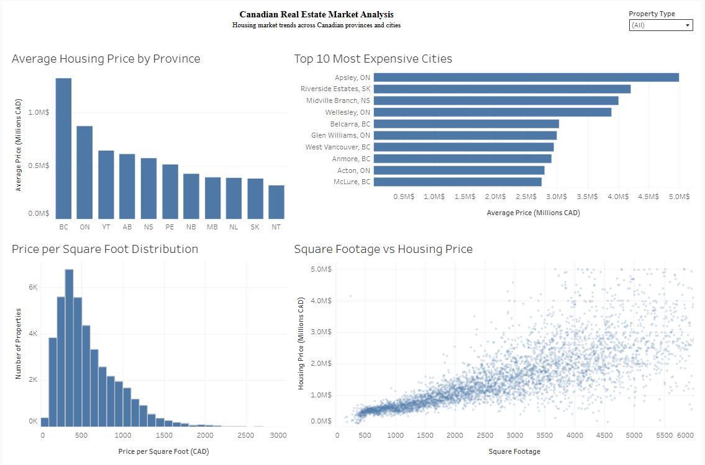

# Canadian Real Estate Listing Analysis

A cross-sectional analysis of Canadian residential property listings, built to compare pricing patterns, listing mix, and regional variation across the provinces represented in the dataset.

The project demonstrates a business-facing reporting workflow: defining comparable market indicators, cleaning listing data, interpreting differences with appropriate context, and communicating results through Python visualizations and an interactive Tableau dashboard.

## Business question

How do listing prices and property characteristics vary across the Canadian locations represented in the dataset, and which patterns are most useful for market reporting?

The analysis focuses on:

- average listing prices by province and city;
- listing volume by bedroom count;
- relationships among price, square footage, and bedrooms;
- price-per-square-foot distributions; and
- an interactive view of regional and property-level differences.

## Data and scope

The notebook describes the source as a Kaggle dataset compiled from RE/MAX Canada listings and collected on February 16, 2025. The original source URL and licensing terms are not stored in this repository.

| Stage | Scope |
|---|---:|
| Source data loaded by the notebook | 44,787 records × 23 fields |
| Analytical dataset after documented filters | 42,509 listing records × 7 selected fields |
| Tableau-ready export | 42,509 records × 10 fields, including derived measures |

The analytical fields are city, province, listing price, bedrooms, bathrooms, property type, and square footage. Derived fields include price in millions, a combined city–province label, and price per square foot.

## Analytical approach

1. Loaded and profiled the source listing data.
2. Selected property and location fields relevant to comparative reporting.
3. Applied project-defined validity filters for price, bedrooms, bathrooms, and square footage.
4. Created price and price-per-square-foot measures.
5. Compared listing prices and volumes across property sizes and locations.
6. Exported the processed analytical dataset for Tableau reporting.

## Verified results

- **British Columbia and Ontario had the highest average listing prices** among the 11 provinces and territories represented after the notebook's filters.
- **Listings with two to four bedrooms represented 72.7%** of the processed analytical records.
- **Average listing price generally increased with bedroom count**, while the square-footage analysis showed a positive relationship between property size and price.
- **Price per square foot was right-skewed**, with most records concentrated below the premium tail.
- Provincial coverage was uneven: British Columbia accounted for more than half of the processed records, so cross-province averages should be interpreted alongside listing counts.

These are descriptive findings about the records analyzed; they are not official Canadian market estimates or evidence of price changes over time.

## Business interpretation

The analysis supports a practical market-reporting view rather than a predictive or causal claim:

- Regional averages help identify where listed properties were more expensive within this dataset.
- Bedroom and square-footage comparisons provide context for how property size relates to asking price.
- Listing counts are necessary alongside averages because geographic and property-type coverage varies substantially.
- Price per square foot provides a normalized comparison, but it still depends on property mix and local coverage.

## Dashboard

[Open the interactive Tableau dashboard](https://public.tableau.com/views/CanadianRealEstateMarketAnalysis_17794230751190/CanadianRealEstateMarketAnalysis?:language=en-US&:display_count=n&:origin=viz_share_link)

The dashboard presents the current training-project analysis and should be read with the data limitations below.

## Limitations

- The data is a **single-date listing snapshot**, so the project evaluates cross-sectional patterns rather than market trends over time.
- Dataset coverage is not demonstrated to be representative of the full Canadian housing market.
- The notebook detected **4,559 duplicated records across the selected analytical fields before filtering**, but did not establish their provenance or remove them. The published export contains 4,342 exact duplicates across those fields; counts and averages therefore describe the processed dataset as implemented.
- City-level averages can be based on very small samples; they should not be used as rankings without a minimum-volume control.
- Cleaning thresholds and the rule used to adjust bedroom or bathroom values above 10 are project-defined assumptions that require source-level validation before external benchmarking.
- The repository does not retain the original raw CSV, source URL, or licensing documentation, which limits full reproducibility and provenance verification.

## Deliverables

- [Jupyter notebook](Canadian_Real_Estate_Market_Analysis.ipynb) — data preparation, exploratory analysis, and visualizations
- [Processed analytical dataset](cleaned_canadian_housing_analysis.csv) — export used for reporting
- [Tableau dashboard](https://public.tableau.com/views/CanadianRealEstateMarketAnalysis_17794230751190/CanadianRealEstateMarketAnalysis?:language=en-US&:display_count=n&:origin=viz_share_link) — interactive presentation
- [Dashboard preview](dashboard_preview.png) — repository image of the published dashboard

## Tools and methods

- **Python:** pandas, NumPy
- **Visualization:** Matplotlib, Seaborn, Tableau
- **Methods:** data profiling, filtering, derived KPI creation, grouped comparisons, distribution analysis, and descriptive market reporting

## Reproduce the analysis

1. Open `Canadian_Real_Estate_Market_Analysis.ipynb`.
2. Replace the notebook's Google Drive source path with the location of the original raw dataset.
3. Run the notebook in order to recreate the processed export and visualizations.

The processed CSV is included for reviewing the current outputs, but the original raw dataset is required to reproduce the full cleaning workflow.
